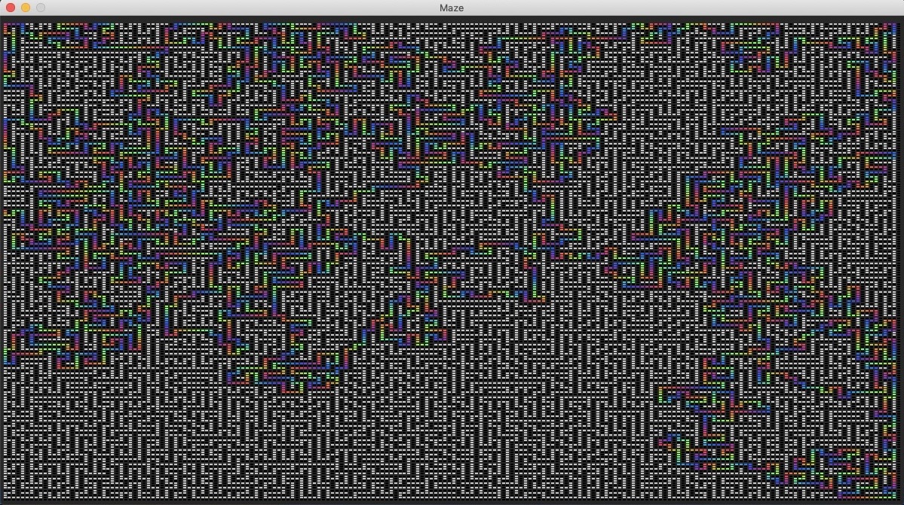

# Maze Generation and Pathfinding Algorithms
Implementation of the 2 maze generation algorithms and the A* pathfinding algorithm in pygame.

## The Algorithms:

### Inle's Algorithm ;)([you can find the algorithm here](rand_maze.py))
I wanted to create my own maze generating algorithm before doing any research.

#### Path_generator
The algorithm uses a path_generator function which makes a random path between two points and works as follows:

1. Start from the start node.
2. Pick a random viable neighbor node to set to current and add to the path.
3. If there are no viable neighbors, restart from the start node
4. If the neighbor is the end node, return the path.

The path_generator function returns very visually appealing writhing paths such as:

####  The algorithm
The Algorithm works as follows:
1. Create a path between the start and end nodes.
2. Generate n pairs of points and create a path between each pair.

The n variable depicts the number of random corridors created. A small n will result in a sparser maze like so: 

While a large n will result in large spaces like below:

#### Analysis
This algorithm could be changed to prefer vertical or horizontal corridors by changing the probability of certain viable neighbors being chosen. Similarly, certain patterns could be selected for by choosing the pairs of end-points from specific areas on the board. 

This algorithm is wildly inefficient, because as the dimensions of the board increase, the probability of the algorithm finding a path which passes through the endpoint before it reaches a dead end approaches 0. Because there is a chance the algorithm continues to randomly pick dead end paths, it has a worst case complexity of theta(infinity). However, this algorithm does create visually appealing cave like mazes. Although it isn't as applicable as the other algorithms below, it was a useful introduction to maze algorithms and I figured I'd share it.

As recursive backtracking and a-star have been described and analyzed many times in the past I will link to my sources for both, but need not describe them myself.
### Recursive Backtracking

### A-Star

## The Functions:([you can find them here](main.py))

### 1. terminal_version():
allows for manual input of the board from the terminal. Uses A-star algorithm.

### 2. manual_version():
requires the user to edit the input board, start and end values in main.py. Uses A-star algorithm.

### 3. rand_maze_pygame(): 
institutes the maze_generator in rand_maze.py and displays the solution with pygame. This uses my random maze generation algorithm detailed above.

### 4. recursive_backtracker(): 
creates a maze with recursive backtracking and solves it with a-star. It displays the solution with pygame.

This is a 200 by 200 large maze created by the recursive backtracker algorithm and solved by the a-star algorithm. This took about 150 seconds to solve. 
